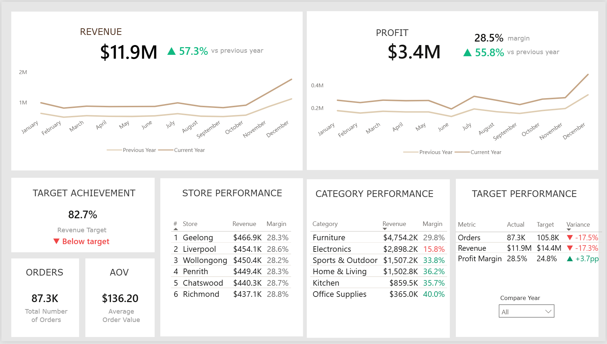
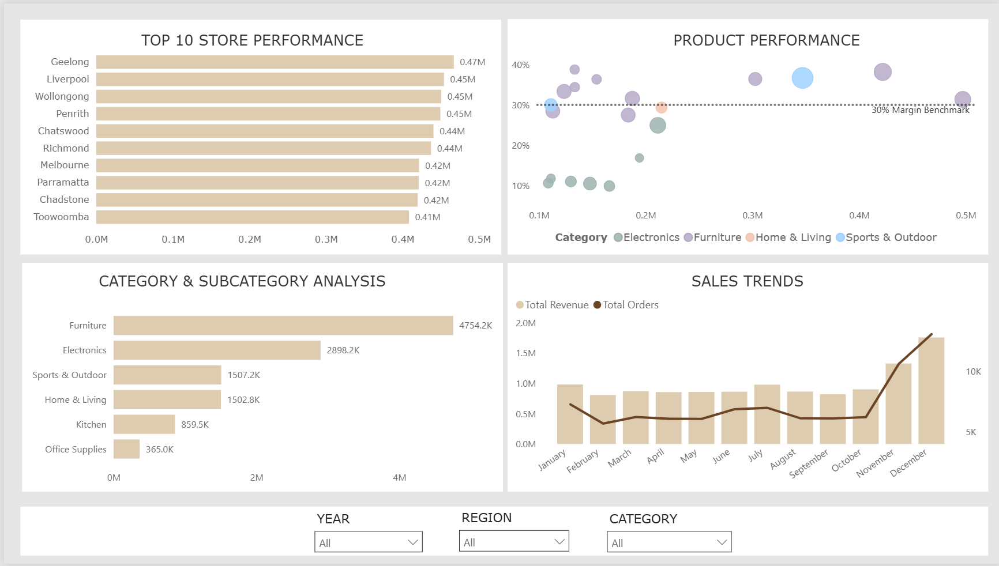
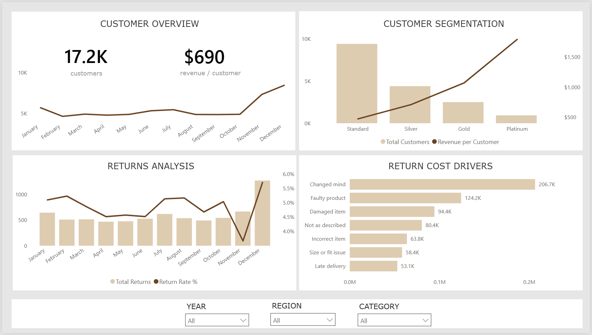
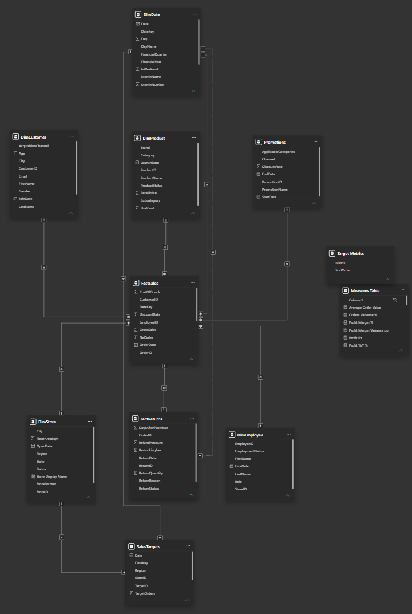

# RetailMart Australia — Power BI Business Intelligence Dashboard

An end-to-end Power BI business intelligence project analysing the performance of a fictional Australian omnichannel retailer across sales, profitability, stores, products, customers and returns.

The project demonstrates the complete BI workflow from data preparation and dimensional modelling through DAX development, interactive dashboard design and business-focused analysis.

## Dashboard Preview

### Executive Overview



### Store & Product Analysis



### Customer & Returns Analysis



---

## Business Scenario

RetailMart Australia is a fictional national omnichannel retailer operating 36 stores alongside online and click-and-collect channels.

Management requires a business intelligence solution that provides visibility into:

- revenue and profitability performance
- year-on-year growth
- performance against business targets
- store and regional performance
- product and category profitability
- customer behaviour and loyalty
- sales trends
- product returns and refund costs

The resulting Power BI report is designed to support both executive monitoring and deeper operational analysis.

---

## Dashboard Pages

### 1. Executive Overview

A high-level view of overall business performance designed for executive decision-making.

Key features include:

- Revenue and profit KPIs
- Year-on-year revenue and profit comparison
- Profit margin
- Total orders and average order value
- Revenue target achievement
- Actual vs target performance
- Top-performing stores
- Category revenue and margin performance
- Dynamic comparison-year selection

### 2. Store & Product Analysis

An interactive analytical page for investigating where business performance is coming from.

Key features include:

- Dynamic Top 10 store ranking
- Store revenue, profit and margin analysis
- Product-level revenue vs profit-margin analysis
- 30% product margin benchmark
- Category-to-subcategory drill-down
- Monthly revenue and order trends
- Interactive Year, Region and Category filters
- Cross-filtering between visuals

### 3. Customer & Returns Analysis

A customer and operational-quality view designed to identify customer-value patterns and the financial impact of returns.

Key features include:

- Active purchasing customer count
- Revenue per customer
- Monthly customer trends
- Loyalty-tier segmentation
- Customer value by loyalty tier
- Monthly return volumes
- Return-rate analysis
- Refund costs by return reason
- Return timing and quantity information through tooltips
- Interactive Year, Region and Category filters

---

## Key Business Insights

The dashboard highlights several commercially relevant patterns within the synthetic RetailMart business:

- Revenue and order volume are below their respective targets, while overall profit margin exceeds target.
- Electronics generates substantial revenue but operates at a considerably lower margin than several other product categories.
- Higher loyalty tiers contain fewer customers but generate substantially greater revenue per customer.
- Store performance varies materially across the network, allowing high-performing locations to be identified dynamically.
- Product-level analysis identifies high-revenue products with comparatively weak margins, highlighting potential pricing or cost-management opportunities.
- Changed-mind returns represent the largest source of refund expenditure, making customer return behaviour a meaningful operational cost driver.

---

## Data Model

The solution uses a dimensional model centred on `FactSales`, with supporting dimensions and additional fact/target tables.



Core tables include:

| Table | Rows |
|---|---:|
| DimDate | 1,096 |
| DimStore | 36 |
| DimEmployee | 220 |
| DimCustomer | 18,000 |
| DimProduct | 480 |
| Promotions | 18 |
| FactSales | 150,000 |
| FactReturns | 7,430 |
| SalesTargets | 1,296 |

Key modelling features include:

- Fact and dimension separation
- One-to-many dimension relationships
- Dedicated date dimension
- Sales target modelling
- Sales-to-return relationships
- Active and inactive date relationships
- Explicit DAX measures
- Dedicated measure table

---

## DAX & Analytical Features

The report uses DAX to implement business logic beyond simple aggregations, including:

- Revenue, profit and profit-margin measures
- Average order value
- Customer-value measures
- Year-on-year calculations
- Dynamic previous-period comparisons
- Target achievement and variance calculations
- Dynamic store ranking
- Product profitability analysis
- Return-rate calculations
- Refund analysis
- `USERELATIONSHIP` for return-date analysis
- Conditional performance indicators

Selected measures and implementation details are documented in [`documentation/DAX_Measures.md`](documentation/DAX_Measures.md).

---

## Data Preparation

Power Query was used to prepare the source data for analysis and ensure appropriate data types, field structures and model compatibility.

The source dataset intentionally contains several realistic data-quality considerations, including missing customer email values and inactive employees, allowing data-cleaning and validation decisions to form part of the BI workflow.

---

## Dataset

The project uses a synthetic dataset designed specifically for realistic business-intelligence analysis.

It models:

- Australian retail seasonality
- Year-on-year sales growth
- Black Friday, Christmas, EOFY and back-to-work promotions
- Physical, online and click-and-collect sales
- Store and regional performance
- Customer loyalty behaviour
- Product margins and discounting
- Returns and refunds
- Monthly store performance targets

The data was generated programmatically in Python using a fixed random seed (`4701`) to make generation reproducible.

Generation methodology is documented in `scripts/GENERATION_NOTES.md`, while `scripts/validate_data.py` performs integrity and relationship validation.

---

## Repository Structure

```text
Power-BI-Portfolio/
│
├── data/
│   └── RetailMart source datasets
│
├── powerbi/
│   └── RetailMart Power BI report (.pbix)
│
├── screenshots/
│   ├── executive-overview.png
│   ├── store-product-analysis.png
│   └── customer-returns-analysis.png
│
├── assets/
│   └── data-model.png
│
├── documentation/
│   ├── Business_Requirements.md
│   ├── Data_Dictionary.md
│   ├── KPI_Definitions.md
│   ├── Proposed_Data_Model.md
│   └── DAX_Measures.md
│
├── scripts/
│   ├── GENERATION_NOTES.md
│   └── validate_data.py
│
└── README.md
```

---

## Tools & Skills Demonstrated

**Power BI**
- Interactive report development
- Dashboard UX and information hierarchy
- Drill-down and cross-filtering
- Conditional formatting
- Tooltips and dynamic filtering

**DAX**
- KPI development
- Filter context
- Time intelligence
- Ranking
- Target variance analysis
- Dynamic measures
- Inactive relationship activation

**Power Query**
- Data preparation
- Data-type management
- Data-quality handling

**Data Modelling**
- Dimensional modelling
- Fact and dimension tables
- Relationship management
- Date modelling
- Multiple fact-table analysis

**Business Intelligence**
- KPI definition
- Executive reporting
- Sales and profitability analysis
- Customer segmentation
- Product and store performance analysis
- Returns analysis
- Business insight communication

---

## Data Disclaimer

RetailMart Australia is fictional. All companies, customers, employees, transactions and financial values in this project are synthetically generated for portfolio and educational purposes.